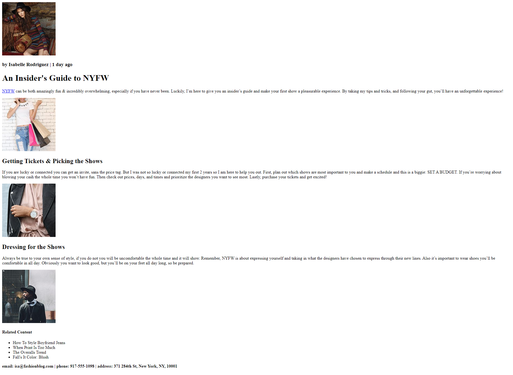

# Fashion-Blog
Shreya B Deshpande
This project is done through Codecademy 'Learn: HTML'
In this project, HTML skills are used to create the underlying structure of a fashion blog, which includes pictures, links, lists, and other HTML elements.

